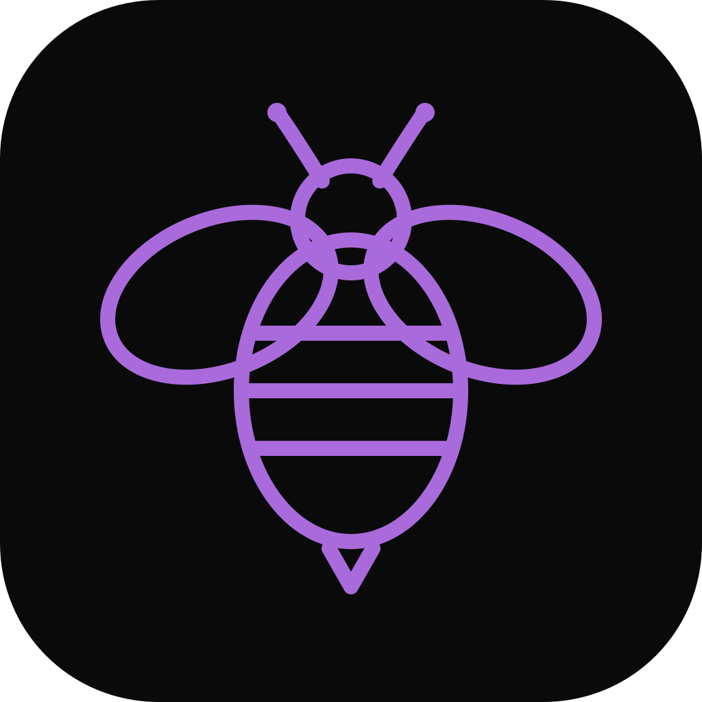
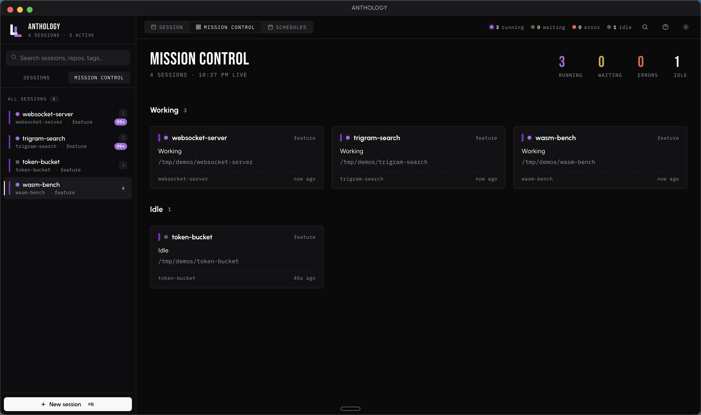
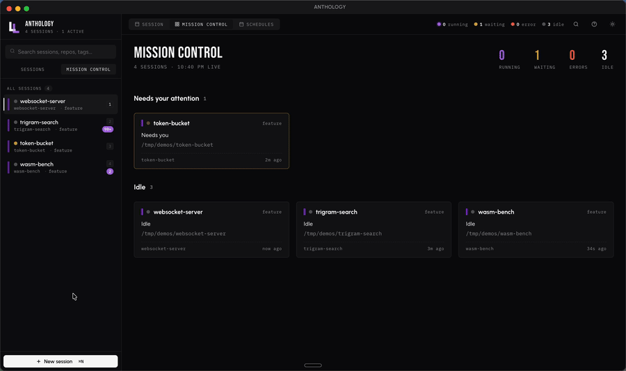
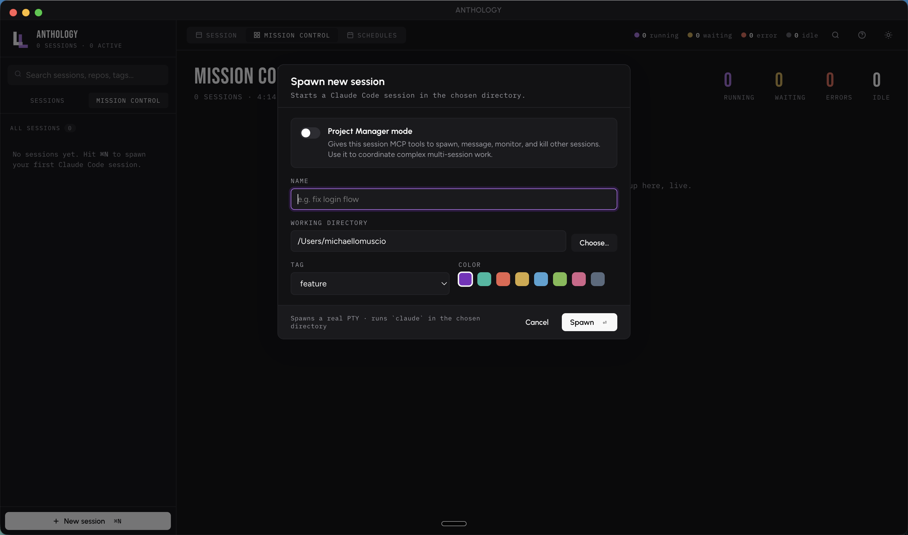
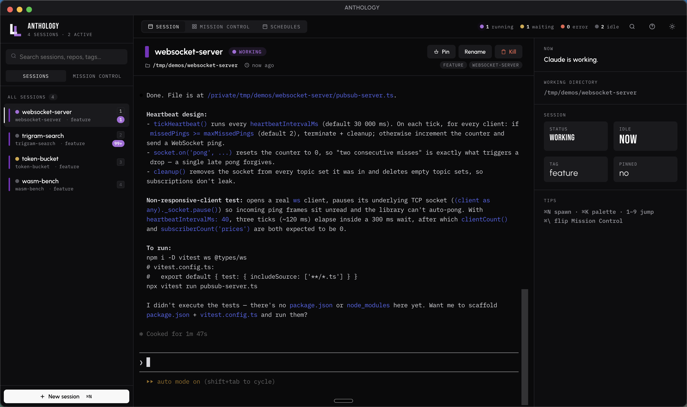
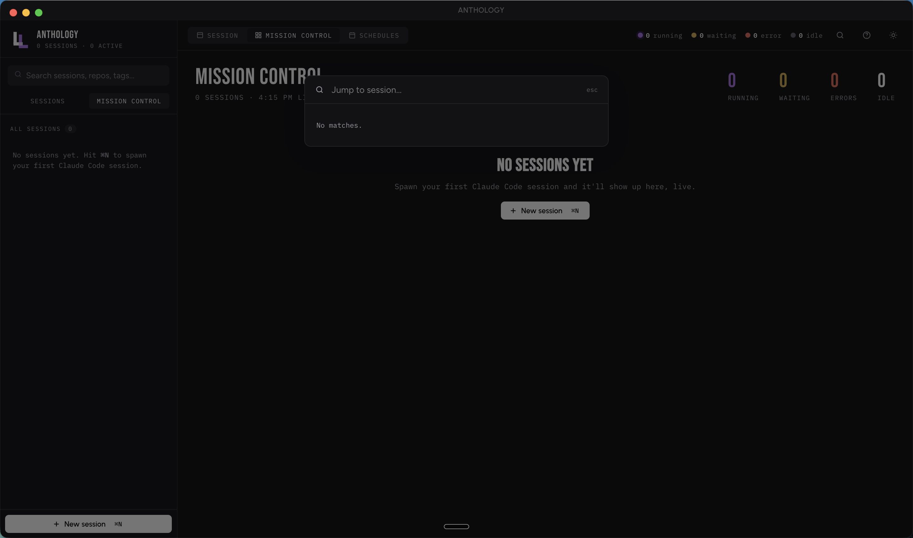

<p align="center">
  
</p>

<h1 align="center">Anthology</h1>

<p align="center">
  <strong>A native macOS app for orchestrating many Claude Code sessions at once.</strong>
</p>

<p align="center">
  
  
  
  
  
  
</p>

---

Claude Code is excellent at deep, focused work in a single repo. The moment you want **two** sessions going — one polishing tests while another drafts a PR description — you're juggling terminal tabs, losing scrollback when something crashes, and missing the notification that one of the agents is waiting on a permission decision.

**Anthology is the manager for those sessions.** Every session is a real PTY with persistent scrollback, surfaced in a sidebar, and pinged to macOS when it needs your attention. Run as many in parallel as your machine handles.

<p align="center">
  
</p>

<p align="center">
  <a href="docs/screenshots/demo.mp4">
    
  </a>
  <br>
  <sub><em>↑ 21-second demo · <a href="docs/screenshots/demo.mp4">download MP4</a> for full quality</em></sub>
</p>

## Download

<p>
  <a href="https://github.com/michaellomuscio/anthology/releases/download/v0.3.1/Anthology-0.3.1-arm64.dmg">
    <strong>⬇ Download Anthology 0.3.1 for Apple Silicon</strong>
  </a>
  &nbsp;·&nbsp;
  <a href="https://github.com/michaellomuscio/anthology/releases/latest">All releases</a>
</p>

> This repository is private. You need to be signed in to GitHub with collaborator access to download.

## Companion projects

This repo is one of three that together make up the Anthology system:

| Repo | What it is |
|---|---|
| **anthology** *(this one)* | The Mac app. Spawns and manages Claude Code sessions; hosts the WebSocket bridge for the iOS companion. |
| **[anthology-ios](https://github.com/michaellomuscio/anthology-ios)** | The iPhone / iPad companion app. Pairs with this Mac app over WebSocket, lets you view and control sessions remotely, and receives push notifications when a session needs attention. |
| **[anthology-push-worker](https://github.com/michaellomuscio/anthology-push-worker)** | A ~150-line Cloudflare Worker (free tier) that signs APNs JWTs and forwards push alerts from this Mac to the iOS app. Stateless. Deploy once with `wrangler deploy`. |

If you only want the Mac app and aren't using the iPhone companion, ignore the other two. Setup walkthroughs:

- iOS app pairing & install — see [`anthology-ios/README.md`](https://github.com/michaellomuscio/anthology-ios#readme)
- Push notification setup (Apple key, Worker, secrets) — see [`docs/SETUP_PUSH.md`](docs/SETUP_PUSH.md)
- Bridge protocol reference — see [`docs/bridge-protocol.md`](docs/bridge-protocol.md)

## Requirements

Two prerequisites are non-negotiable:

| | |
|---|---|
| **Apple Silicon Mac** | M1, M2, M3, or M4. The build is `arm64`-only and will not launch on Intel. |
| **Claude Code installed and signed in** | Anthology spawns the real `claude` CLI under the hood. It does not bundle Claude. |

Install Claude Code if you haven't already:

```bash
npm install -g @anthropic-ai/claude-code
claude          # complete the sign-in once
claude --version
```

Full Anthropic setup guide → <https://docs.claude.com/en/docs/claude-code/setup>

macOS 14 (Sonoma) or newer recommended.

## Install

1. Download `Anthology-0.2.0-arm64.dmg` from the link above.
2. Double-click to mount, then drag **Anthology.app** into your **Applications** folder.
3. Open it from Applications or Spotlight.

The app is signed with an Apple Developer ID and notarized by Apple, so Gatekeeper opens it cleanly the first time — no right-click trick needed.

## What it does

### Sessions

Hit **⌘N** to spawn a session. Pick a working directory — that's where `claude` runs and what files the agent can see. Optionally name it, color it, or tag it.

<p align="center">
  
</p>

Each session is a real `node-pty` pseudo-terminal. The xterm.js renderer is WebGL-accelerated. Scrollback persists to disk per-session, so an app restart or a session crash never loses context. Sessions you've ended stay in the sidebar with a **Restart** banner.

The sidebar lists every session by name, working directory, and tag. A status dot keeps you oriented; a metadata panel on the right surfaces the active session's state at a glance.

<p align="center">
  
</p>

### Mission Control

The top-bar toggle flips between three views:

- **Session** — full terminal for the active session.
- **Mission Control** — a tile per session showing live status, last activity, and recent output. Built for watching a fleet.
- **Schedules** — cron-style timers that fire actions into sessions (e.g. "send the message *daily standup* into my PM session at 9am every weekday").

### Status & notifications

Every session has a colored status dot:

| | |
|---|---|
| 🟢 | **running** — Claude is actively working. |
| 🟡 | **waiting** — Claude is asking for a permission decision. |
| 🔴 | **error** — a tool call failed. |
| ⚪ | **idle** — nothing happening. |

When a session you're not currently looking at goes into `waiting` or `error`, Anthology fires a native macOS notification and increments a dock badge. You won't miss the moment a background agent is blocked on you.

### Project Manager mode

In the spawn dialog, toggle **Project Manager mode** to give a session MCP tools that let it spawn, message, monitor, and kill *other* sessions. This is the most differentiated feature: one Claude session coordinates a multi-session effort — a PM session delegating chunks of a large refactor to worker sessions, then collecting their results.

Anthology runs a small local MCP HTTP server that the PM session connects to. The server is bound to localhost with a per-session token; nothing is exposed to the network.

### Phone companion (new in 0.3)

A WebSocket bridge inside Anthology lets the [iOS companion app](https://github.com/michaellomuscio/anthology-ios) view and control sessions from your phone — over LAN, [Tailscale](https://tailscale.com), or anywhere with internet. Pairing is QR-based and one-shot; tokens are stored as `sha256` hashes on the Mac and revocable from the phone icon in the top bar.

Optional: configure a free [Cloudflare Worker](https://github.com/michaellomuscio/anthology-push-worker) so the phone wakes up with a banner when a session goes `waiting` or `error` while the iOS app is closed. Setup walkthrough at [`docs/SETUP_PUSH.md`](docs/SETUP_PUSH.md).

### Keyboard shortcuts

| Shortcut | Action |
| --- | --- |
| `⌘N` | New session |
| `⌘K` | Open command palette |
| `⌘\` | Toggle Session ↔ Mission Control |
| `⌘1`–`⌘9` | Jump to session 1–9 (works while typing in the terminal) |
| `1`–`9` | Jump to session 1–9 (when not typing) |
| `Esc` | Close any modal |

<p align="center">
  
</p>

## Architecture

```
┌──────────────────────────────────────────────────────────────────┐
│  Renderer  (React + xterm.js + WebGL)                            │
│  ┌──────────┐  ┌──────────────────┐  ┌────────────┐  ┌────────┐  │
│  │ Sidebar  │  │  Session view /  │  │ Schedules  │  │ Cmd ⌘K │  │
│  │  + tags  │  │  Mission Control │  │   editor   │  │ palette│  │
│  └──────────┘  └──────────────────┘  └────────────┘  └────────┘  │
└──────────────────────────────────┬───────────────────────────────┘
                                   │   IPC (typed preload bridge)
┌──────────────────────────────────┴───────────────────────────────┐
│  Main process  (Electron)                                        │
│  ┌──────────────┐  ┌──────────────┐  ┌─────────────┐  ┌────────┐ │
│  │ PTY manager  │  │ Buffer store │  │  Scheduler  │  │  MCP   │ │
│  │ (node-pty)   │  │ (per-sess)   │  │ (node-cron) │  │ server │ │
│  └──────┬───────┘  └──────────────┘  └─────────────┘  └────┬───┘ │
└─────────┼────────────────────────────────────────────────────┼───┘
          │                                                    │
          ▼                                                    ▼
   ┌─────────────┐                                    ┌────────────────┐
   │  claude CLI │  (one process per session)         │ Claude session │
   │   (PTY)     │                                    │ in PM mode     │
   └─────────────┘                                    │ → MCP tools to │
                                                      │   spawn/msg/   │
                                                      │   monitor      │
                                                      └────────────────┘
```

A few design choices worth calling out:

- **Real PTYs, not mocks.** Anthology spawns the genuine `claude` binary in a pseudo-terminal so every CLI feature (slash commands, permission prompts, tool output) renders identically to a normal terminal session.
- **Scrollback is durable.** Each session's terminal buffer is serialized to disk continuously. App restarts and session crashes don't lose context.
- **WebGL terminal.** xterm.js with the WebGL addon keeps a many-session view smooth; falls back to a 2D canvas if WebGL is unavailable.
- **MCP, locked down.** The PM-mode MCP server binds to `127.0.0.1`, requires a per-session bearer token, and validates session IDs against a strict allow-list to prevent path traversal in the on-disk session store.
- **Hardened runtime + notarization.** Production builds enable Apple's hardened runtime and ship through the notary service.

## Tech stack

- **Electron 33** — native shell, tray, notifications, dock badges
- **React 18 + Vite** — renderer UI, fast HMR in dev
- **xterm.js 6** with WebGL, Unicode 11, image, web-links, search, and serialize addons
- **node-pty** — real pseudo-terminals for each `claude` session
- **node-cron** — schedules
- **`ws`** — WebSocket server hosting the iOS companion bridge
- **electron-builder** — signed, notarized, hardened-runtime DMG builds

## Privacy & security

- **No telemetry.** Anthology makes zero network calls of its own. The only outbound traffic comes from the `claude` subprocesses themselves — identical to running `claude` in a regular terminal.
- **Local-only state.** Sessions, scrollback buffers, and schedules live in `~/Library/Application Support/anthology/` and never leave the machine.
- **Signed and notarized.** Distributed builds are signed with an Apple Developer ID and notarized through Apple's notary service.
- **MCP scope-limited.** The local MCP server binds to localhost, uses a per-session token, and validates all session IDs against a path-traversal-safe character class before touching disk.
- **URL allow-list.** Clickable links in terminal output (via the WebLinks addon) are restricted to `http(s)://` and `mailto:` — printed `file://` or custom-scheme URLs cannot trigger native side effects.

## Building from source

```bash
git clone https://github.com/michaellomuscio/anthology.git
cd anthology
npm install
npm run dev          # dev mode with renderer hot-reload
npm run build        # produce an unsigned .dmg in ./dist
```

For a signed + notarized build (you need an Apple Developer ID), copy `.env.example` to `.env`, fill in your signing credentials, then:

```bash
npm run build:signed
```

## Project structure

```
anthology/
├── src/
│   ├── main/                   # Electron main process
│   │   ├── main.js             # app lifecycle, IPC, window mgmt
│   │   ├── preload.js          # typed bridge into the renderer
│   │   ├── pty-manager.js      # spawn / write / kill / status events
│   │   ├── buffer-store.js     # per-session scrollback persistence
│   │   ├── sessions-store.js   # session list metadata
│   │   ├── scheduler.js        # cron-style schedules
│   │   ├── mcp-server.js       # local MCP HTTP server for PM mode
│   │   ├── mcp-tools.js        # MCP tool implementations
│   │   ├── bridge-server.js    # WebSocket bridge for the iOS companion
│   │   ├── bridge-tokens.js    # pairing codes + bearer tokens
│   │   ├── bridge-config.js    # push-relay Worker URL + secret
│   │   └── push-dispatcher.js  # forwards waiting/error to APNs via the Worker
│   └── renderer/               # React UI
│       ├── App.jsx
│       ├── components/         # Sidebar, Terminal, MissionControl, PhonePairing, …
│       ├── styles/             # design tokens + app stylesheet
│       └── assets/             # logo marks
├── docs/
│   ├── bridge-protocol.md      # iOS-companion WebSocket protocol spec
│   └── SETUP_PUSH.md           # end-to-end push notification setup
├── build/                      # icon source + entitlements
├── electron-builder.config.js  # signing / notarization / DMG layout
├── vite.config.js
└── test/                       # MCP + bridge tests
```

## Troubleshooting

<details>
<summary><strong>"Anthology can't be opened because Apple cannot check it for malicious software."</strong></summary>

You're on an older macOS where Gatekeeper hasn't cached the notarization ticket yet. Right-click the app → **Open** → **Open** in the dialog. You only need to do this once.
</details>

<details>
<summary><strong>Spawning a session immediately exits with "command not found: claude".</strong></summary>

Claude Code isn't on the PATH that GUI apps see. Open a terminal, run `which claude` to confirm it's installed, then either reinstall with `npm install -g @anthropic-ai/claude-code` or symlink the binary into `/usr/local/bin`.
</details>

<details>
<summary><strong>The terminal area is blank.</strong></summary>

Almost always a WebGL initialization issue. Quit and relaunch — the renderer falls back to a 2D canvas if WebGL is unavailable.
</details>

<details>
<summary><strong>A session is stuck on "waiting" but I never see a permission prompt.</strong></summary>

Switch into the session — Claude Code only renders the prompt in the focused terminal. The status dot fires whether or not you're looking at it.
</details>

## About

Anthology is built by **Dr. Michael Lomuscio** — Lomuscio Labs. It started as a personal tool for running multiple long-lived Claude Code sessions across a portfolio of projects, and grew into something worth distributing.

Questions, bugs, or feature requests: open an issue.

## License

Copyright © 2026 Michael Lomuscio. All rights reserved.

Distributed privately to invited collaborators only. See [LICENSE](LICENSE) for terms.
